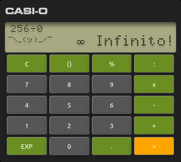

# CASI-O
Calculadora Aritmética Simple Intuitiva Opinable

**[DEMO](https://zalitoar.github.io/CASI-O)**

# Atribuciones

The FontStruction “FX-4000P” (https://fontstruct.com/fontstructions/show/908945) by A. Vidovic is licensed under a Creative Commons CC0 Public Domain Dedication license (http://creativecommons.org/publicdomain/zero/1.0/).

# To do

- [ ] Editar operación ya escrita
- [ ] Detectar paréntesis sin cerrar
- [ ] Evaluar prioridad de operaciones anidadas
- [ ] Corregir manejo de decimales
- [ ] Manejo de signos
- [ ] Cálculo de porcentaje
